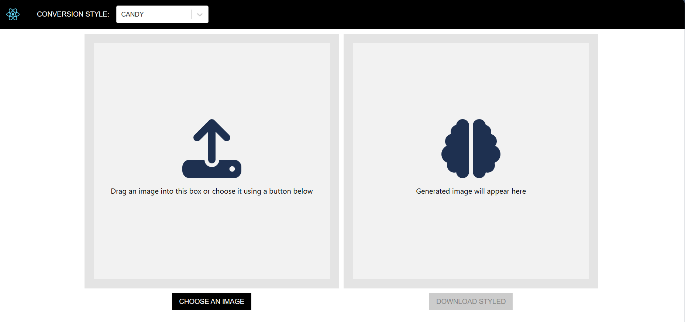
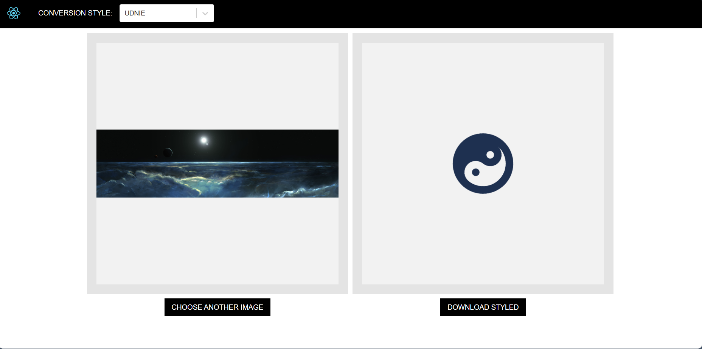
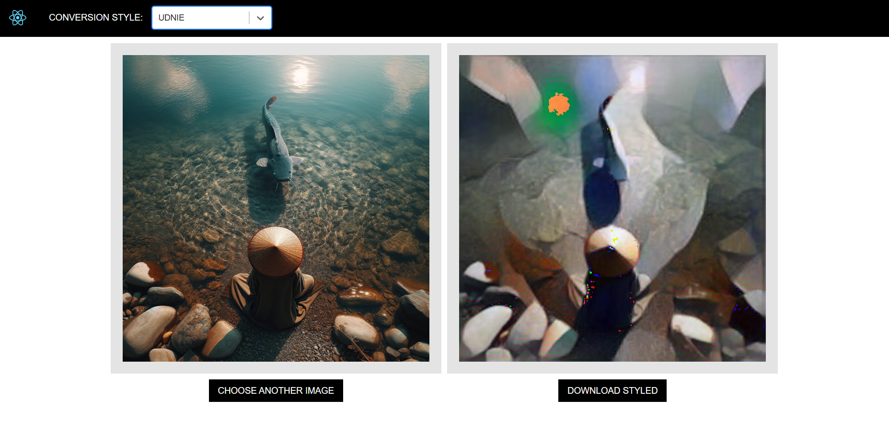
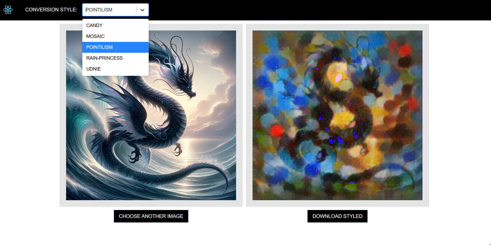
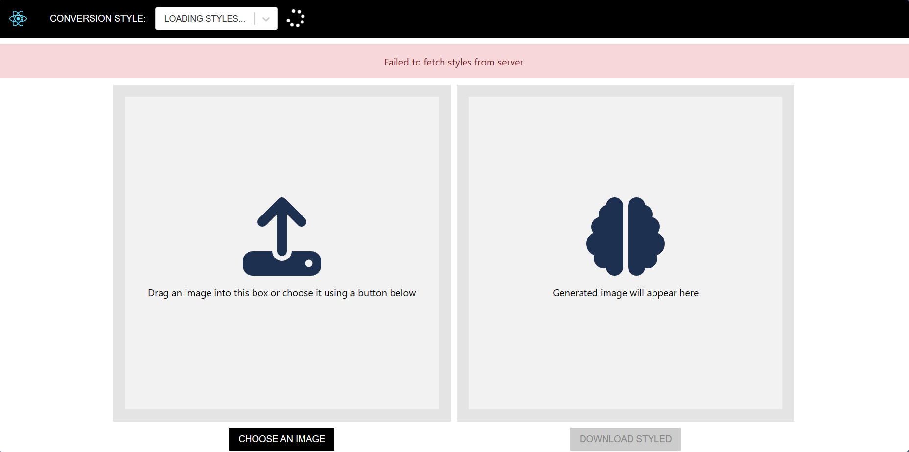

# Image Styler
This repository contains the source code and documentation for a simple Image Styling App.
The TypeScript/React web-application takes a picture uploaded by the user and styles this picture with the help of a simple Python backend API and ML models hosted on OVMS server.
Docker compose allows developers to have an easy trial on their local machines.
Blog post about the application: https://cyber-observer.blogspot.com/2024/01/openvino-unveiled-streamlining-model.html

## User Experience

The user is presented with a simple user interface featuring a supported styles dropdown and a side-by-side image preview area.
The input image area allows Drag&Drop and has a self-explanatory button. A button for downloading styled images is disabled until a styled image is present -- to further reduce the number of things a user needs to consider on the first go.

After an image was uploaded, a spinner appears on the generated image half. Notably, image resizing is handled automatically by the API -- saving the user from the need to prepare images on their machine before uploading them.

Upon processing completion, the download button becomes visible. 

A user might try to select another style, the generation would be triggered by the act of selection itself. 

There is an error handling mechanism enabled in the application. If it would happen that the API would return an error -- it would appear inside of the dedicated error bar.
If the backend API would be unavailable, styles selection is blocked. The message is displayed inside of that component and a spinner will inform the user that the app is trying to connect.
The automatic retry happens every thirty seconds and an error message would be displayed on each failed connection. This way the user is informed that things are doing their best.

## Project Structure

The project is organized as follows:

- `model-server/`: This directory contains the OVMS (OpenVINO Model Server) for serving AI models.
    - `models` subdirectory is organized per OpenVino [documentation](https://docs.openvino.ai/2023.2/notebooks/117-model-server-with-output.html#step-2-preparing-a-model-repository)
    - `original-models` are ONNX models from murilocurti's repository (https://github.com/murilocurti/onnx__models)
    - `converter.py` is a script used to convert `.onnx` to [OpenVino IR](https://docs.openvino.ai/2023.2/openvino_ir.html) format
- `ovms-api/`: This directory contains the Python API based on FastAPI.
- `web/`: This directory contains the web application built with TypeScript and React.
- `docker-compose.yml`: This file orchestrates the deployment of the three-tier application.

The `docker-compose.yml` file in the root of the project orchestrates the deployment of the three-tier application. Follow the instructions from the official [documentation](https://docs.docker.com/compose/install/) to install it. Simply run `docker-compose up` command in the root directory to start the application.